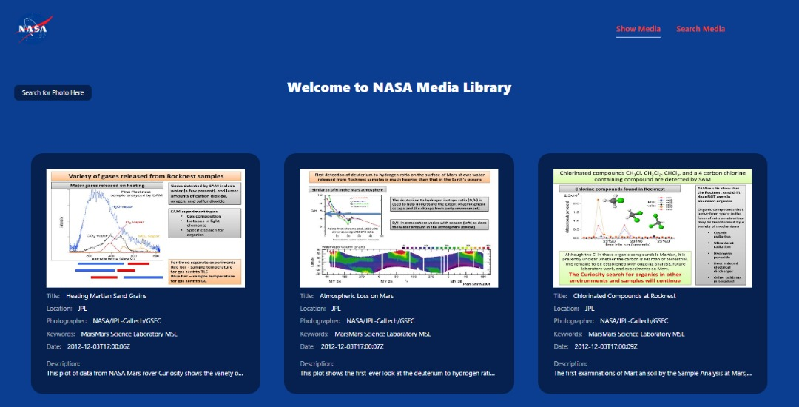

# NASA MEDIA LIBRARY

>This web application get NASA media library data of different centers. User can filter search by some parameters such as start and end date and will be able to search individual media items using item properties such as title, photographer, center etc.



## BUILT WITH

-- Basic Language - JavaScript 
- Framework - React
- Other technologies/tools: 

``` create-react-app
    > create-react-app
    > webpack for bundling files
    > Babel for code transpiling
    > Git for version control
    > Eslint for JavaScript linting
    > Stylelint for style linting
    > Jest for testing
    > NASA media API
    > SASS and Tailwind for styling
 ```

## Live Demo

[Live Demo Link](https://nasa-media-library.herokuapp.com/)

## Getting Started

To get a local copy up and running follow these simple example steps.

1. Clone the repository using

```
git clone https://github.com/KingsleyIbe/NAZA-media-library.git
```

2. cd into the cloned repository

```
cd NAZA-media-library
```

3. You now have the access to the files on your local machine!

#### Optional steps

Install the node_modules/ folder to be able to locally run the linter commands. Run:

```
npm install
```


To check Stylelint linter errors run:

```
npx stylelint "**/*.scss"
```

To check ESLint errors run:

```
npx eslint .
```

To check Test run:

```
npm test
```

## 👤 **Author**

- GitHub: [@Kingsleyibe](https://github.com/kingsleyibe)
- Twitter: [@ibekingsley2](https://twitter.com/ibekingsley2)
- LinkedIn: [Kingsley Ibe](https://www.linkedin.com/in/kingsley-ibe-5669a5134/)

## 🤝 Contributing

Contributions, issues, and feature requests are welcome!

Feel free to check the [issues page](https://github.com/KingsleyIbe/NAZA-media-library/issues).

## Show your support

Give a ⭐️ if you like this project!

## Acknowledgement

NASA API

## 📝 License

This project is [MIT](./MIT.md) licensed.
